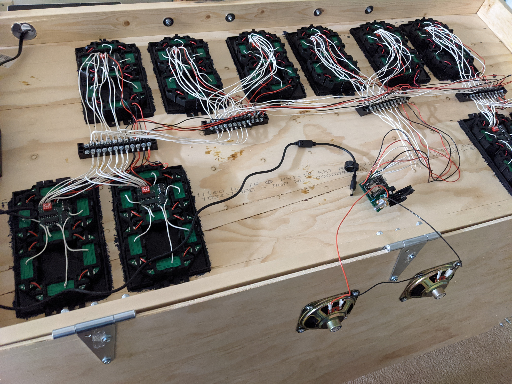

# GymClock

This repository contains the Arduino code, Blender models, and Kicad projects that I used to build the programmable gym clock at the [Fremont Gymnasium](https://www.fremontgymnasium.com/).

## How it works

### Hardware

The hardware components that make up the electrical part of the sign are the segments, the
digit controllers, the shared control bus, and the central controller.

- There are 70 **segments** in the display, grouped into 10 digits of 7 segments each (labeled A-G).
I designed the [segment PCB](kicad/SevenSegment/) in an elongated hexagon shape so 7 of them
could be laid together to form the shape of an 8, as is standard for 7-segment displays.
Electrically, each segment has 15V power and ground connectors at each tip of the PCB, as
well as a 3.3V connector in the middle which feeds into the base of a transistor to turn
the segment on or off. The segments contain internal resistors to limit both the 15V and
3.3V currents to the appropriate level. Having the power and ground connectors at the tip
of each segment allowed me to connect all 7 segments in a digit together end-to-end. This
reduced the number and size of wires needed per-segment. Power and ground can be connected
to only one segment and will then flow through the tip connections to the rest of the
segments in that digit.
- There are 10 **digit controllers**, one per digit. The digit controller takes input
signals from the control bus, and has 7 output wires that switch the 7 segments that
make up that display on or off (actually there is an 8th output for controlling a colon/separator
LED segment but its unused). The digit controller has no microprocessor, only fixed-function
IC components. The way that the 10 identically-constructed digit controllers are able to
know which bus signals are meant for them are by way of a 4-channel DIP switch (4 bits
giving 16 possible digit addresses - the sign uses only 10). The digit controller uses an
identity comparator IC to compare the setting of the DIP switch with 4 bits from the bus
input. Only if the 4 bits match are the remaining 3 logic lines from the bus connected to
an shift register IC on the digit controller. The shift register has 8 bits of storage,
which correspond to the 7 segments and 1 (unused) colon control outputs. The fact that a
shift register is used means that the digit controller has persistent memory - once it has
been programmed with a given 8-bit pattern, it is able to hold that pattern (aka keep the
LED segments lit) without further input needed from the central controller.
- The **central** bus is composed of 11 wires: 2 wires for 15V power and ground, 2 wires for 3.3V
power and ground, 7 wires for 3.3V logic signals. The 2 15V power and ground wires connect
directly to the tip-interconnected segments; the remaining 9 wires connect all the digit
controllers and the central controller together. All 10 digit controllers and the central
controller share the same single bus. All wires are driven high/low by the central controller
alone - there is no reverse communication from digit controller to central controller. As
described above, 4 of the logic wires carry the address bits that allow the central controller
to select a specific digit. The remaining 3 logic wires are connected to the SER, RCLK, and
SRCLK inputs of the digit controllers' shift registers. Because of my lack of experience
with bus wiring options, I used individual wires for all the bus lines, and (relatively)
enormous terminal blocks as the junction points for 3- and 4-way bus joins. Its messy, but
it works.
- The **central controller** is an ESP8266 microcontroller, embedded in a very simple
motherboard with some additional components for speaker amplification and volume control.
The ESP8266 is connected directly to the 7 bus logic lines and drives the wires high/low
to select and "program" the shift registers on the individual digits.

### Lit window

Because each digit controller has a programmable shift register, technically speaking the
display can light all 10 digits simultaneously. However, when all 7 segments are continuously
lit, a digit consumes a full 1 amp. This means having all 10 digits lit would take 10 amps,
which is way more current than I felt safe using. So instead, the display works by the
central controller iterating over each digit, turning it on, turning it off, and moving to
the next digit, in a continuous loop. The loop would be so fast that our eye's persistence
of vision would mean that we see the entire display as being lit, even if only one digit
is lit at a time.

The above description is not fully accurate. There is a concept of a "lit window",
which is a sliding window of digits that are all lit at once. The above descripton was of
a lit window of length 1, but the display actually uses a lit window of size 3. There is
still a loop, but it works by turning on the next digit, then turning off the digit 3 spaces
back. At any point in time, 3 digits are lit. The size of the lit window is a tradeoff
between brightness and current consumption. The longer the lit window, the more time that
digits spend lit up and so the brighter they look. However, the longer the lit window, the
more amps that are used by the display. A lit window of size N should use N amps. I found
that a lit window of 3 gave good brightness results while still keeping the current consumption
reasonable.

Speaking of current consumption, current measurements using my bench power supply as well
as a Kill-A-Watt device show significantly lower current usage than the ~3 amps I would
expect for a fully-lit display (all digits showing 8s). I'm not sure whether this is simply
measurement error (power switching on and off too fast for accurate measurements) or whether
the LEDs used do have a "startup time" where they don't immediately get to full current draw
until some time after being turned on. Either way, I used a 4-amp power supply to be safe.

**Historical note**: The shift register-based digit controller is actually the second
version of digit controller. The first version used a 3-to-8 demultiplexer and had no memory.
All 7 wires on the bus were effectively address bits for the 70 segments on the board, and
the central controller could turn on exactly 1 segment at a time. This resulted in
fantastically low current consumption, but the display was too dim. I had to replace and
rewire the 10 digit controllers with the second generation shift register-based one,
resulting in higher current draw but also much more satisfactory brightness.

### Software

I used the [ESP8266 Arduino core](https://github.com/esp8266/Arduino) to program the
central controller. The various HTTP services - the user control pages, the admin pages,
the remote update server - were all built using code from the ESP8266 Arduino core library.
The reason they all are so basic is because I had to store all the HTML pages as string
literals - no fancy web frameworks or templating engines here!

To implement the display functions (clock, stopwatch, etc) I used the
[AceRoutine](https://github.com/bxparks/AceRoutine) library to write them as coroutines instead
of manually implemented state machines. Although I found a
[bug](https://github.com/bxparks/AceRoutine/issues/19) in the library, it was overall an
enormous help and made it possible to implement much more elaborate functions than I would
have had the patience to do otherwise (and much quicker too!).

## How to update

If you're ok with pulling the sign down, you can flash the esp8266 via the usb port as normal. The sketch also supports wireless flashing of signed binaries. The public key for the signing is the [public.key](public.key) file in this repo. The private key is on my laptop. I'll also store a copy of the private key in a USB drive and put the drive inside the sign itself.

## Errata

I had a bug in the DigitController2 schematic that I didn't catch until after I had the PCBs manufactured. The bug was that the SER and SRCLK lines are swapped. I fixed the bug in the schematic, but did not order new PCBs because I was able to work around the bug by simply swapping the SER and SRCLK wiring lines from the central controller to the main bus.
